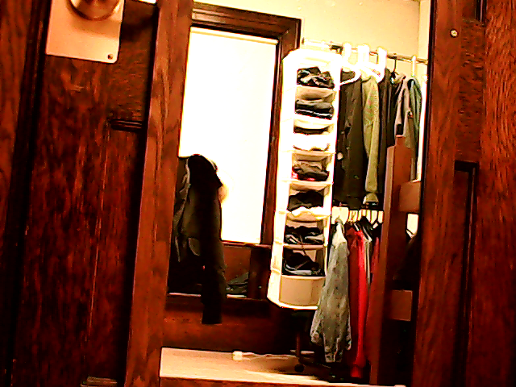
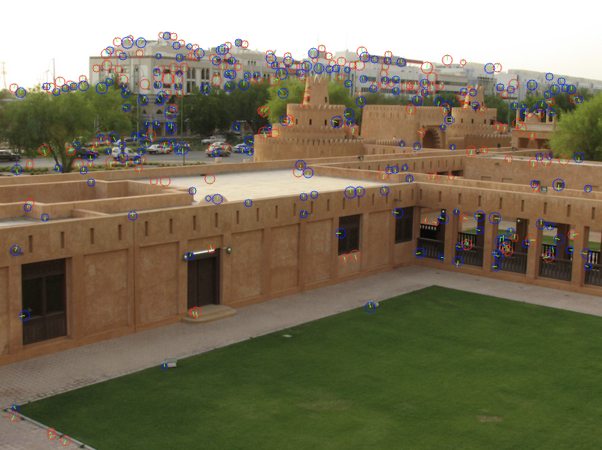
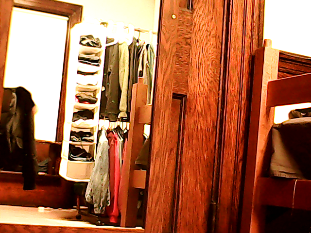

# Real-Time Image Stitching
CS205 Computing Foundations for Computational Science Final Project

Harvard University, 2018 Spring

Team members: Weihang Zhang, Xuefeng Peng, Jiacheng Shi, Ziqi Guo

**This page only provides technical documentations about the project. For a complete view of our project including motivation, design approach, results and analysis, please head over to the [project website](https://cs205-stitching.github.io).** 


## Project Goal

**Image stitching** or photo stitching is the process of combining multiple photographic images with overlapping fields of view to produce a segmented panorama or high-resolution image (example below).


(source: http://www.arcsoft.com/technology/stitching.html)

In this project, we want to use big compute techniques to parallelize the algorithms of image stitching, so that we can stream videos from adjacent camera into a single panoramic view.


## Instructions


### Compile Dependencies:
- GCC 6 or higher
- OpenCV 3.4.0 or higher
- pkg-config


### Compile:

`cd` to one of the **surf_sequential/**, **surf_omp/**, or **surf_openacc/** folders before compiling your code.


#### Sequential Version

##### MacOS:
```
g++-7 -std=c++11 -fpermissive -o test main.cpp fasthessian.cpp integral.cpp ipoint.cpp surf.cpp utils.cpp `pkg-config opencv --cflags --libs`
```
Adapt `g++-7` to the version of g++.

##### Ubuntu: 

```
g++ -std=c++11 -fpermissive -o test main.cpp fasthessian.cpp integral.cpp ipoint.cpp surf.cpp utils.cpp `pkg-config opencv --cflags --libs`
```


#### OpenMP Version

##### MacOS:

```
g++-7 -fopenmp -std=c++11 -fpermissive -O3 -o test main.cpp fasthessian.cpp integral.cpp ipoint.cpp surf.cpp utils.cpp `pkg-config opencv --cflags --libs`
```
Adapt `g++-7` to the version of g++.

##### Ubuntu:

```
g++ -fopenmp -std=c++11 -fpermissive -O3 -o test main.cpp fasthessian.cpp integral.cpp ipoint.cpp surf.cpp utils.cpp `pkg-config opencv --cflags --libs`
```
##### 

#### OpenACC Version

The OpenACC version can only be compiled and run on a device with GPU. Before compiling, set the environment with `source env.sh`.

##### Machine with GTX GPU: 

```
pgc++ -acc -ta=tesla:cc60 -Minfo -std=c++11 -O3 -o test main.cpp fasthessian.cpp integral.cpp ipoint.cpp surf.cpp utils.cpp `pkg-config opencv --cflags --libs`
```

##### Machine with Tesla GPU: 

```
pgc++ -acc -ta=tesla -Minfo -std=c++11 -O3 -o test main.cpp fasthessian.cpp integral.cpp ipoint.cpp surf.cpp utils.cpp `pkg-config opencv --cflags --libs`
```


### Run Test Cases:

To run test cases, first compile with instructions above, but without using any parallelization (for OpenMP, remove `-fopenmp`; for OpenACC, use `g++` instead of `pgc++`). 

Then run:

``sh sample_test.sh``

When the stitched image pops out, press ``Esc`` button.

The test shell script will check the output with the standard output running on our development machine. If it does not print anything after "Took: xxx seconds" line, then you are good to go!


### Run:

``./test -m <mode> [...]``

**Argument Options** (< > after flag indicates argument is required)

- -m | --mode < >: 

  - 0: run SURF on a single image
  - 1: run static image match between a pair of images
  - 2: run image stitching with webcam stream
  - 3: run image stitching with local video files

- -b | --blend_mode: (no additional argument)
         
  - if set, run blending algorithm with stitching; otherwise, run regular stitching algorithm

- -r | --resolution (for mode 2 and 3 only):

  - user-specified resolution

- -s | --single\_mem\_cpy: (OpenACC only)

  - if set, one single mem copy; otherwise, do memory copy from host to device every response layer

- -t | --threaded: (OpenACC only)

  - if set, using the multi-threading version for task-level parallelization

- -S/L/R | --src/src1/src2 <path>
         
  - <path> path of  image/video to be processed. For mode 0, `-S|--src` will be used for single image feature extraction; for mode 1 and mode 3, `-LR|--src1 --src2` will be used for image/video stitching from local files
  - if flags are not set, will use sample image/video given by this repository


## Examples

#### Mode 0: Run SURF on a single image

- Command: `./test -m 0`

- Input image:



- Output image:




#### Mode 1: Run static image match between a pair of images

- Command: 

| Input image 1     | Input image 2     |
| ----------------- | ----------------- |
|  |  |

- Output image:


#### Mode 2: Run image stitching with webcam stream

##### 720P, single memory copy:

- Command: `./test -m 2 -r 720 -s`
- Demo: https://youtu.be/DG2lm59jOk8 

##### 720P, single memory copy, with blending:

- Command: `./test -m 2 -r 720 -s -b`
- Demo: https://youtu.be/PLp8XQtipk0


## References

- SURF code source: https://github.com/julapy/ofxOpenSurf
- Data source: videos taken from [Logitech webcams](https://www.amazon.com/Logitech-Laptop-Webcam-Design-360-Degree/dp/B004YW7WCY/ref=sr_1_8?s=pc&ie=UTF8&qid=1525394553&sr=1-8&keywords=logitech+webcam)
- Knowledge references:
  - Image stitching overview: http://ppwwyyxx.com/2016/How-to-Write-a-Panorama-Stitcher/
  - Keypoint detection: [Speed-Up Robust Features (SURF)](http://www.vision.ee.ethz.ch/~surf/eccv06.pdf)
  - Transformation estimation: [Random Sample Consensus (RANSAC)](http://www.cse.yorku.ca/~kosta/CompVis_Notes/ransac.pdf)
  - Perspective warping: https://github.com/stheakanath/panorama
  - Blending: Multi-band Blending: [A Multiresolution Spline With Application to Image Mosaics](http://persci.mit.edu/pub_pdfs/spline83.pdf)
